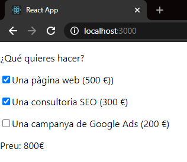
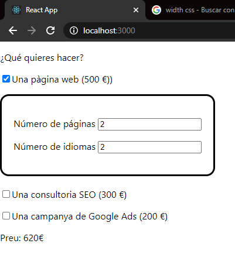

# Sprint-7_Presupuesto


### Exercici 1
La nostra aplicació començarà amb tres checkboxes mitjançant els quals l'usuari/ària podrà decidir si vol obtenir el pressupost d'una pàgina web (500 €), una campanya SEO (300 €) o una campanya de publicitat (200 €).

En funció de les opcions que marqui, es mostrarà un preu diferent.




De moment no et compliquis, implementa aquesta lògica en el component principal App. 

Simplement, hauràs de crear 3 caselles de selecció que executi una funció, passant a aquesta funció l'esdeveniment de la casella de selecció, per a saber quina casella de selecció ha estat clicat. En funció de la casella de selecció que s'hagi premut, hauràs de modificar el preu total en conseqüència. 


 >Important

> Pots guardar la situació de cada casella de selecció en estats diferents per a poder calcular el total o bé es pot crear un únic estat en format array per a centralitzar la situació de les tres caselles de selecció.
> Convé guardar el pressupost total calculat en un estat.

### Exercici 2
Una vegada creades les caselles de selecció que permetran a l'usuari/ària seleccionar el tipus de servei que necessita, li oferirem l'opció d'ajustar un dels serveis: crear una pàgina web, podent triar el nombre de pàgines i d'idiomes.

Per a això, cal definir un styled-component anomenat Panell que serà visible quan el client/a seleccioni que vol fer una pàgina web.


Dins d'aquest component, el client/a podrà seleccionar el nombre de pàgines i el nombre d'idiomes de la web que desitja fer. 

Al cost total de la web haurem d'afegir la següent quantitat:

-  Nombre de pàgines * el nombre d'idiomes * 30 €.



### Exercici 3
GENIAL!, l'usuari/ària ja pot demanar 3 dels nostres serveis i customitzar un d'ells. 

Per a fer la vida més fàcil a l'usuari/ària, en lloc de fer-li teclejar el nombre de pàgines i idiomes que necessita, li posarem uns botons als costats de l'input perquè de manera fàcil pugui modificar la seva selecció.

Per a ells, has de canviar els ```<input type = "text" />``` del panell per un nou component fet a mida, que tindrà botons d'incrementar i decrementar la quantitat, a més d'un quadre de text en què podrem escriure la quantitat directament:


Let's go!

### Exercici 4
Ja gairebé has completat la base del projecte, et falta guardar les dades dels camps seleccionats per l'usuari en localstorage.

Has d'usar el hook useEffect per a carregar les dades del localstorage quan s'inicialitzi el component.


### Exercici 5
Per a acabar aquesta primera fase del projecte, és necessari implementar una pantalla de benvinguda per l'usuari/ària, on s'expliqui el propòsit i funcionament de la web.

És necessari que implementis la navegació entre vistes utilitzant el routing de React.


[resources](https://bobbyhadz.com/blog/react-only-number-input)